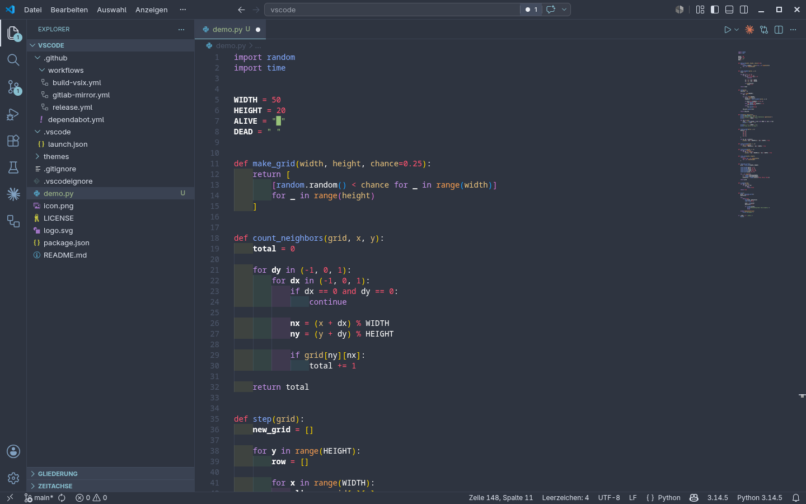
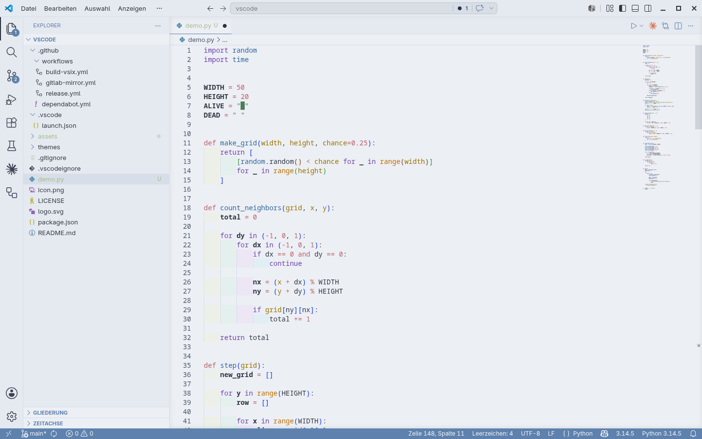

# Frostfire Theme

A dual-variant VSCode color theme balancing icy Nord blues with expressive syntax highlighting.

## Preview

### Dark



### Light



## Variants

| Variant | Background | UI Accent |
|---|---|---|
| **Frostfire Dark** | `#2E3440` Polar Night | `#88C0D0` Frost |
| **Frostfire Light** | `#ECEFF4` Snow Storm | `#5E81AC` Frost |

## Color Palette

### Dark

| Role | Color |
|---|---|
| Background | `#2E3440` |
| Foreground | `#D8DEE9` |
| Keywords | `#C792EA` purple |
| Functions | `#82AAFF` blue |
| Strings | `#98C379` green |
| Classes | `#F69D50` orange |
| Numbers | `#FF5370` red |
| Parameters | `#e5c07b` yellow |
| Comments | `#ABB2BF` muted |
| Errors | `#BF616A` |

### Light

| Role | Color |
|---|---|
| Background | `#ECEFF4` |
| Foreground | `#2E3440` |
| Keywords | `#7040AA` purple |
| Functions | `#2F6699` blue |
| Strings | `#4A7C59` green |
| Classes | `#C07000` orange |
| Numbers | `#BF616A` red |
| Parameters | `#9A7200` yellow |
| Comments | `#6A737D` muted |
| Errors | `#BF616A` |

## Installation

### Via VSIX (recommended)

Download `frostfire-theme.vsix` from the [latest release](https://github.com/eskopp/vscode/releases/latest) and run:

```bash
code --install-extension frostfire-theme.vsix
```

### From source

```bash
git clone https://github.com/eskopp/vscode
cd vscode
# Press F5 in VSCode to launch the Extension Development Host
```

## License

MIT
